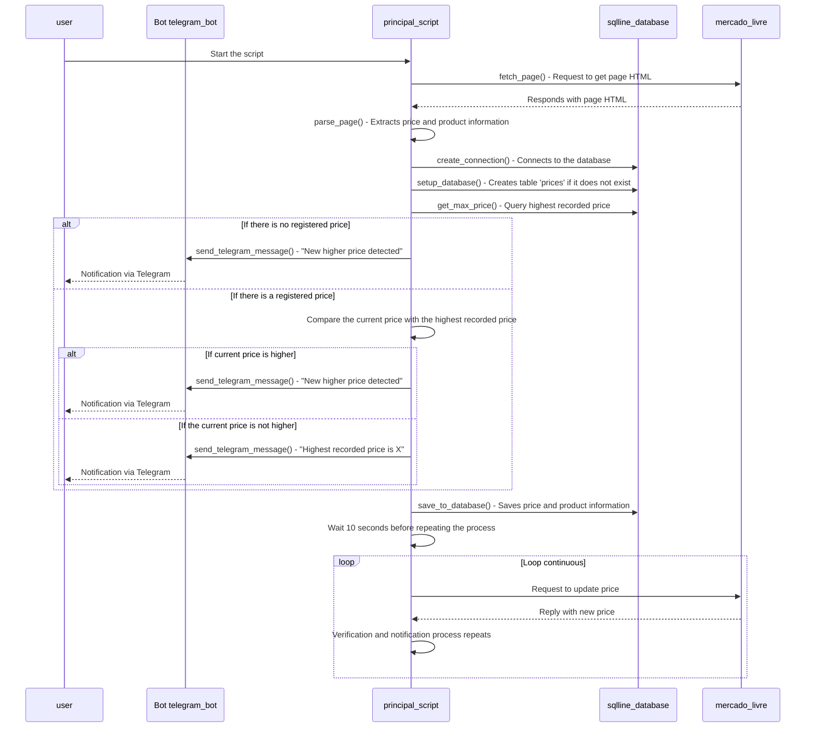

# web-scraping-pipeline-extract

# Price Monitoring with Web Scraping and Telegram Notifications

This project monitors product prices on e-commerce sites. Using web scraping techniques, the project collects prices and sends notifications on Telegram when the value reaches a specific limit defined by the user. The application is modular, divided into parts to facilitate development and maintenance.



## Libraries Used and Explanation

1. **requests**: Used to make HTTP requests and obtain the HTML of web pages.
2. **BeautifulSoup (bs4)**: Used to analyze and extract specific information from the HTML of pages, such as the price of the product.
3. **schedule**: Library for scheduling tasks, allowing you to check prices at regular intervals.
4. **pandas**: Facilitates data manipulation, allowing you to save and load price histories in CSV files.
5. **sqlite3**: A lightweight SQLite database used to store and organize price data over time.
6. **python-telegram-bot**: Library for sending messages to Telegram, notifying the user when the price reaches a specific value.
7. **python-dotenv**: Loads environment variables from a `.env` file, where sensitive information such as the Telegram token and chat ID is stored.

## Prerequisites

1. **Python 3.6+**: Make sure you have Python 3.6 or higher installed.
2. **Dependencies**: Install the libraries listed in the `requirements.txt` file.

To install dependencies, run the command:
```bash
pip install -r requirements.txt 
```

